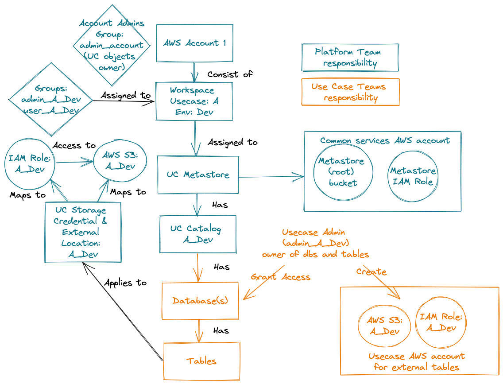

# Unity Catalog Deployment with Terraform on AWS

This repository contains an example of end to end unity catalog deployment with terraform on aws. 
As part of the deployment Databricks unity catalog resources and required AWS resources are created.

## Configuration

There are two configuration files that you should adjust prior to running the terraform code:

1. `main/config.tfvars` - contains the main deployment configuration.
   The main setting is `usecases` array that contains use cases configuration.
   
   Workspaces that are specified in the array will be attached to the metastore automatically.
   The name and environment fields are used for naming resources as prefix.
   Data role and bucket are used for creating storage credentials and external locations for external tables.
   ```
   usecases = [
     {
       name = "usecase1"
       environment = "dev"
       workspace_name = "dev1"
       # data role as per https://docs.databricks.com/data-governance/unity-catalog/get-started.html#configure-a-storage-bucket-and-iam-role-in-aws
       data_role_arn = "arn:aws:iam::11111111111:role/<company-name>-role-uc-external-location-uc-dev"
       data_bucket = "<company-name>-uc-dev"
     }
      /* add more use cases here */
   ]
   ```
2. `main/backend.conf` - contains backend configuration for storage of the terraform state files.

## Setup

1. Install databricks CLI: https://docs.databricks.com/dev-tools/cli/index.html#install-the-cli
2. Install the latest terraform CLI: https://learn.hashicorp.com/tutorials/terraform/install-cli
3. Create aws profile called `uc` for the aws account where uc metastore (bucket, iam role) should be created: https://docs.aws.amazon.com/cli/latest/userguide/cli-configure-profiles.html
3. Store databricks credentials in AWS Secret Manager of the `uc` aws account:
    * account console credentials: store username and password in `databricks/account_owner_credentials` secret. 
      If SSO is enabled for the account console, you have to provide account owner/root credentials!
      Token based authentication for the account console will be available in the future.
    * workspace token: generate PAT token for your user in any of your workspaces and store it in `databricks/workspace_token` secret.
4. Create S3 bucket and IAM role for use cases as defined in the `main/config.tfvars` (see `data_bucket` and `data_role_arn`): 
   https://docs.databricks.com/data-governance/unity-catalog/manage-external-locations-and-credentials.html
   
## Usage

1. Run terraform plan: ./deploy.sh
2. Deploy resources: ./deploy.sh apply

## Repo structure

```
.
├── main                        # Main code that run the individual terraform modules
├── modules
    ├── metastore               # Terraform module for deploying metastore and required aws resources (S3 bucket, IAM role)
    ├── usecase                 # A set of terraform modules for deploying use case specific unity catalog objects, e.g. catalogs, storage credentials, external locations
    ├── account                 # A set of terraform modules for deploying account objects, e.g. groups, service principals
    ├── service-principal-token # Terraform module for creating service principal token and store in aws secret manager
├── deploy.sh                   # Script that can be used for running the terraform code and deploying the resources
├── design.png
├── design.excalidraw
├── LICENSE
└── README.md
```

## Design decisions

The deployment follows the following design:

* One Databricks account is used
* One Unity Catalog metastore for all workspaces is created. If you have workspaces located in multiple aws regions, you will have to create a separate metastore for each region!
* One catalog, storage credential, and external location is created for each use case and environment: `<usecase>_<environment>`
* One set of groups is created for each use case and environment: `admin_<usecase>_<environment>` (owner of databases and tables), `user_<usecase>_<environment>` (users with default usage/view access to a use case catalog)
* One account admin group for the platform team is created. The group is used as an owner for all unity catalog objects created as part of this deployment, e.g. metastore, catalogs, external locations, storage credentials etc.
* One Service Principal (sp) for automation is created for each use case and environment: `sp_<usecase>_<environment>`
* Use case teams are responsible for creating one unity catalog compatible S3 bucket and IAM role for external locations and tables. 
  This could also be part of this deployment but it would put more burden on the platform team.
* Use case teams are responsible for providing LOCATIONs when creating external tables so that the data lands in the correct use case S3 buckets. 
  
> **_NOTE:_**  Databricks will provide a functionality to specify LOCATION at the catalog level for managed tables in the future 
> so that the platform team will be able to manage the LOCATIONs for the use case teams. 
> At the moment, if you want your data to be stored in separate buckets outside the root metastore bucket you need to use external tables.

### Organizational Model of Governance

The design follows a shared responsibility model where the platform team is responsible for all Unity Catalog setup 
and management up to catalogs. 

The use case teams are responsible for creating and granting access to databases and tables,
as well as use case specific AWS resources (e.g. buckets and iam roles for storage credentials and external locations).


  
## Resources to be created as part of the deployment

* Create account admin group in the databricks account console. Not needed if provisioned via SCIM from IdP.
* Assign predefined admin users (in `main/config.tfvars`) to the account admin group
* Create admin group in the account console for each use case. Not needed if provisioned via SCIM from IdP.
* Create user group in the account console for each use case. Not needed if provisioned via SCIM from IdP.
* Create service principal in the account for each use case and add it to the use case admin group.
* Create unity catalog metastore and create the required AWS resources (metastore S3 bucket and IAM role)
* Assign use case user and admin groups to the respective workspaces
* Assign account admin group to all workspaces
* Create external locations and storage credentials for each use case. Buckets and IAM roles for the external locations are not part of this deployment. 
* Create catalog for each use case

If you want to get more details, have a look inside `main/main.tf` file.


Creating tables is not part of the deployment and should be the responsibility of the use case teams.

## Terraform providers (authentication)

Providers are used to define connections/authentication to various resources and are defined in `main/providers.tf` file.

1. AWS provider to the aws account where unity catalog metastore resources should be deployed. 
   The authentication is done with aws profile. 
```
provider "aws" {
  alias = "uc"
  region = "eu-west-1"
  profile = var.aws_profile
}
```

2. Databricks provider for the Databricks account console. This is used for creating account level resources like groups and assigning them to workspaces.
```
provider "databricks" {
  alias = "account"
  host = "https://accounts.cloud.databricks.com/"
  account_id = var.databricks_account_id
  username = jsondecode(data.aws_secretsmanager_secret_version.account_credentials.secret_string)["user"]
  password = jsondecode(data.aws_secretsmanager_secret_version.account_credentials.secret_string)["password"]
}
```
The authentication can only be done at the moment using basic auth with username and password.
In addition, if SSO is enabled for the account console, account owner/root credentials have to be used.
The username and password are retrieved from AWS Secret Manager for security reasons.

Databricks will support authentication to the account console using user or service principal tokens.

3. Databricks provider for a Databricks workspace that is used for deploying Unity Catalog resources, e.g. metastore, catalogs, tables, storage credentials, external locations
 
```
provider "databricks" {
  alias = "workspace"
  host = var.workspace_host
  token = jsondecode(data.aws_secretsmanager_secret_version.workspace_token.secret_string)["token"]
}
```
The authentication to the workspace is performed using [PAT token](https://docs.databricks.com/dev-tools/api/latest/authentication.html)
The token has to be generated for a user or service principal that is a Databricks account admin!

> **_NOTE:_**  Unity Catalog resources are account level resources, and it might be counterintuitive but 
> unity catalog resources have to be deployed using a Databricks workspace provider (not account provider).
> You can use any workspace as long as it belongs to the Databricks account you are using.
